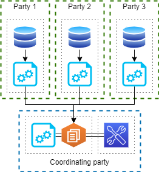
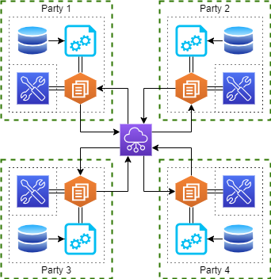

==============================
Distribution topology
==============================

A topology is how the nodes are distributed across the network.
This can influence the types of algorithms and Artifact that can be submitted to the network.

Based on the configuration of each node, the framework can work in two topologies: *centralized* and *decentralized*.

Centralized topology
==============================

In a *centralized topology* a central node act both as an aggregator and a coordinator for all the nodes in the network.

This is the only available topology for worker nodes in **client** mode, although nodes in **node** mode can still join such network.

_Workbenches* can both be internal o external respect to the consortium network, but the need to connect to the aggregator node to submit the Artifacts.

Sometimes, in this topology, the aggregator node does not share local data and work with the resources produced by the client nodes.

Decentralized topology
==============================

In a *decentralized topology* all nodes can connect and communicate with all the other nodes part of the network.

In this situation, the *workbenches* can connect to any node.
When a new Artifact is deployed, the receiver will became the scheduler and the aggregation node for the specified Artifact.

This topology allows a more fluid exchange of resources; given the fact that a nodes knows each other, the aggregation and fusion algorithms can be more complex and leverage on the structure of the network itself to operate.

Hybrid topology
==============================

We have an *hybrid* topology when we mix nodes in *client* mode with other in *node* mode.
In this situation, clients can still participate in the creation of resources but they need to send resources through a proxy node.
This limits the available types of algorithms and at the same time slows the performance of the network, given the fact that we need to use proxy nodes.
